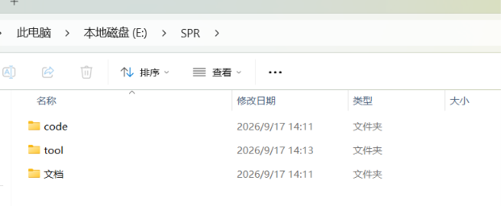
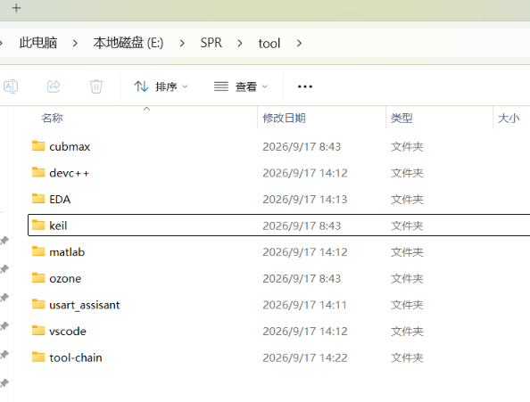
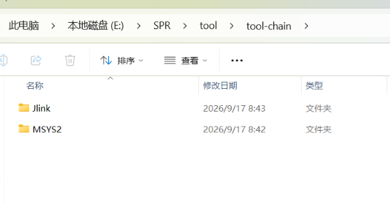

<!--
 * @Author:度宝武 
 * @Date: 2026-08-27 18:04:30
 * @LastEditors: 哨兵电控 度宝武 2786573564@qq.com
 * @LastEditTime: 2026-09-17 14:24:11
 * @FilePath: \27-SPR\02-嵌入式电控开发环境配置\2.1-工具链配置\2.1.0-电脑环境的整洁.md
 * @Description: 
 * 
 * Copyright (c) 2026 by ${2786573564@qq.com}, All Rights Reserved. 
-->
# 2.1.0 电脑环境的整洁

> 开工之前，先把你的电脑"收拾干净"——环境整洁，后面调 bug 才能不迷路。

## 铁律

1. **所有下载的东西，不放 C 盘。** C 盘是系统盘，越满越卡。工具、软件、工程，一律装到别的盘。
2. **每个盘的文件夹，做好分类。** 别让所有东西堆在桌面和"下载"里——按 工具 / 工程 / 文档 / 图片 分开。
3. **SPR 的工具，统一放一个地方。** 放在 D 盘或 E 盘下的 `SPR` 文件夹里。全队一个标准，换电脑、换人都不慌。
4. **无论你下载的什么软件（B站，抖音，壁纸....），禁止开机自启动**
5. **路径里不许出现中文。** 工具装在哪、代码放哪，路径一律**纯英文**——`E:\SPR\tool\...` ✅，`E:\文档\培训\代码\...` ❌
   **为什么？** 不少开发工具（`gdb` 调试器、`make`、`cmake`、交叉编译工具链）是按 **ANSI 编码**去理解路径的，而你文件夹名里存的是 **UTF-8** 的中文。两边对不上，工具就找不到文件，然后报一个看着莫名其妙的错。
   **最典型的症状**（一按 F5 调试就会见到）：gdb 说 `E:\文档\...\code_c_study: No such file or directory.` —— 路径明明存在，它偏说没有。（实测：同一份代码，英文路径能调试，中文路径就报这个。）
   ⚠️ **坑就坑在它不是一直报**：`gcc` 编译中文路径是好的，程序也跑得动，**只有调试器会挂**——特别容易误判成"我 `launch.json` 写错了"，白折腾半天。
   **怎么落地**：在英文路径下建一个专门放练习代码的文件夹，比如 `E:\SPR\c_study`。

## 参考图

