# 2.1 · 工具链全家桶配置

> 目标：把你的电脑变成一台"嵌入式开发工作站"。
## 要装什么、为什么

| 课程 | 装什么 | 为什么 |
|---|---|---|
| 2.1.1 | Keil | 保底方案：旧代码 / 救急用，不是你的主力 |
| 2.1.2 | VSCode + EIDE 插件 + GCC-ARM | 主力：现代编辑器 + 开源工具链 |
| 2.1.3 | MSYS2 + MinGW64（arm-none-eabi-gcc / make / cmake） | 包管理器 + 交叉编译器；CMake 让你理解"编译过程"（预处理→编译→汇编→链接），而不是点一下按钮 |
| 2.1.4 | 环境变量（PATH） | 让命令行能找到工具，否则装了也调不出来 |
| 2.1.5 | J-Link 驱动 | 命令行烧录、可自动化的调试 |
| 2.1.6 | STM32CubeMX | 图形化快速配置硬件、生成初始化代码 |
| 2.1.7 | Ozone | 波形调试：看变量实时曲线，定位 bug |
| 2.1.8 | 串口助手（MobaXterm / Putty） | 串口是嵌入式工程师的第二只眼睛 |

## 配置
# keil
自行了解
Keil 是“新手村武器”——上手快，但出了新手村就没用了。

# vscode  编程
VSCode + GCC + CMake 是“真正上战场用的武器”——大厂的嵌入式团队、开源社区、机器人公司都在用这套组合
1. 下载 https://code.visualstudio.com/
2. 下载插件（左侧俄罗斯方块按钮） 


# 3. 工具链  MSYS2 MinGW64
MSYS2 + MinGW64 是这套方案的核心。简单来说，MSYS2 是包管理工具，MinGW64 是它里面的一个工具包。
我们要用它们来安装 arm-none-eabi- 系列工具链（用来编译 ARM 芯片代码）和 make、cmake 等构建工具
## (1) MSYS2（车间 + 仓库管理员）
它是什么：一个在 Windows 上运行的“类 Linux 环境”（提供 Bash 终端），外加一个包管理器（pacman）——类似手机上的应用商店。它干了什么：它帮你把 Windows 电脑“模拟”出一个可以敲 Linux 命令（如 make、ls、cd）的终端，并且负责从网上下载、安装、更新你需要的所有开发工具（GCC、CMake、Git 等）。
一句话总结：它是你所有开发工具的“底座”和“快递员”。
### 下载地址 https://www.msys2.org/
 
 点击下载的.exe文件
 选择文件路径E:\SPR\tool\tool-chain\MSYS2（自己按照上一章的要求进行创建文件夹）
 
 
## （2）arm-none-eabi-gcc（造 STM32 程序的工具链）
它是什么：交叉编译器。它能把同样的 C/C++ 代码，编译成能在 STM32 芯片（ARM 架构）上运行的机器码（.bin 或 .hex 文件）。为什么叫“交叉”：因为你的电脑是 x86 架构，而 STM32 是 ARM 架构。“交叉”就是“在一台机器上编译出在另一台完全不同架构的机器上运行的程序”。一句话总结：这个工具造的东西，是给 STM32 芯片看的（跑在嵌入式板子上）。
### 安装 刚刚的终端中 输入 pacman -S mingw-w64-ucrt-x86_64-arm-none-eabi-toolchain 如图

### 验证 arm-none-eabi-gcc --version 效果如下为有效

## 2. MinGW-w64（造 Windows 程序的工具链）
它是什么：GCC 编译器在 Windows 上的一个版本。它能把你写的 C/C++ 代码，编译成能在你电脑（x86架构）上直接运行的 .exe 程序。在开发中的作用：当你在电脑上写模拟程序、上位机测试工具，或者跑一些本地调试脚本时，用它来编译。
一句话总结：这个工具造的东西，是给你电脑自己看的（跑在 Windows 上）。
## MSYS2安装的时候已经安装过了 验证显示版本号为 有效
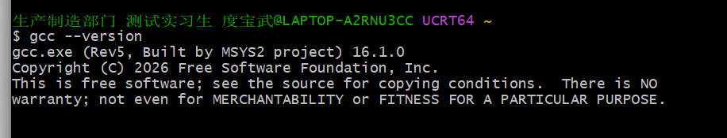


## 最终环节环境变量
### 1.电脑键盘左下角的方块 win 键 或者电脑屏幕最下面的蓝方块，搜索栏目搜索环境变量打开

### 2. 点击环境变量

### 3.1 文件资源管理器（电脑文件夹应该都知道吧 dog） 找到这个目录，在上方复制路径
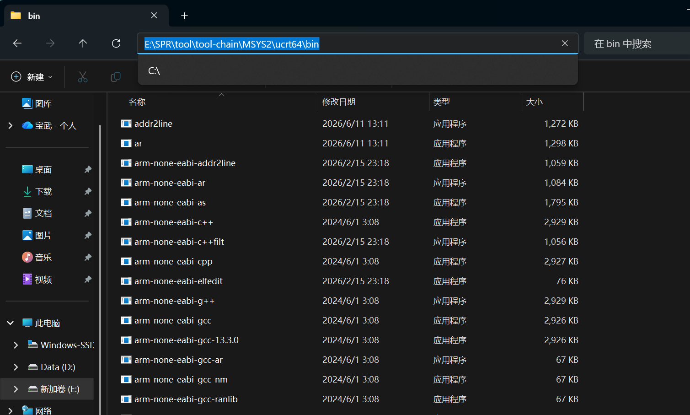
### 3.2 回到步骤二 点击环境变量，点击编辑 如图 粘贴刚刚复制的环境变量
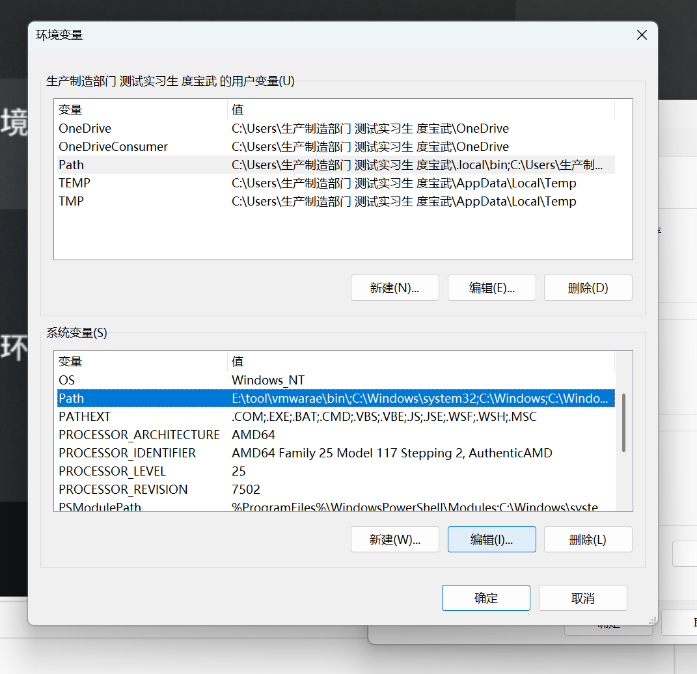 
### 4.添加该路径置电脑的系统环境变量中

### 5.完全退出VSCODE，再进去，让环境变量生效，代开VSCODE的终端
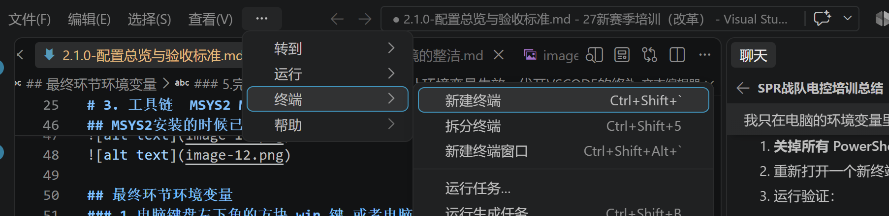
### 输入arm-none-eabi-gcc --version 最终效果如图
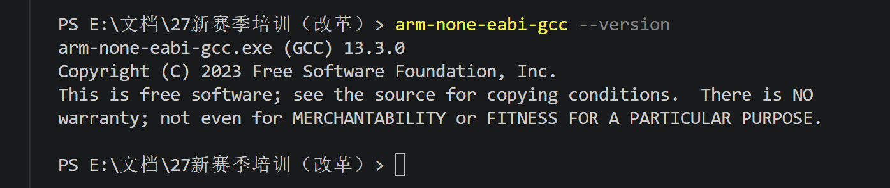
# 4. jlink 烧录工具的驱动 （选择7.58b 版本 如果你有钱当我没说 dog）

# 同意
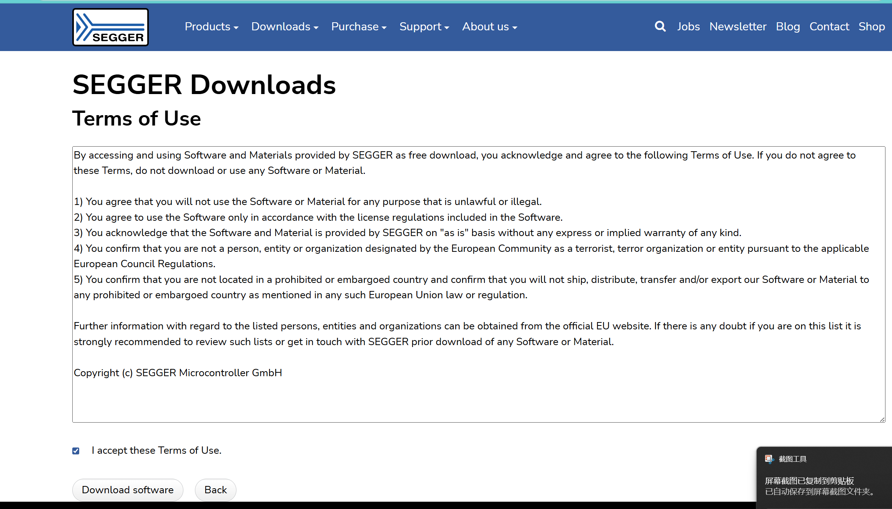
### 选择对应的文件夹
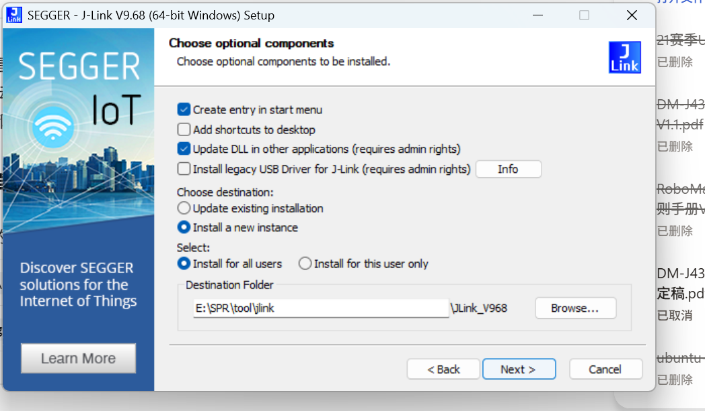
# 找到文件夹路径，添加至环境变量，步骤和之前一样 
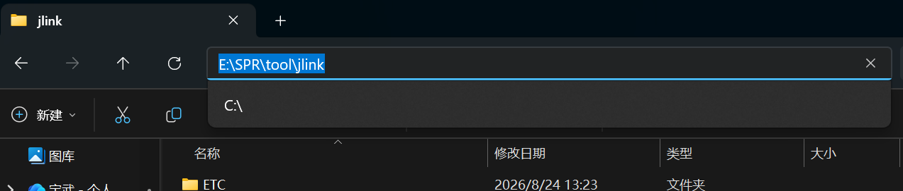
# 验证 vscode 完全退出重启 终端输入 jlink 有版本号为有效
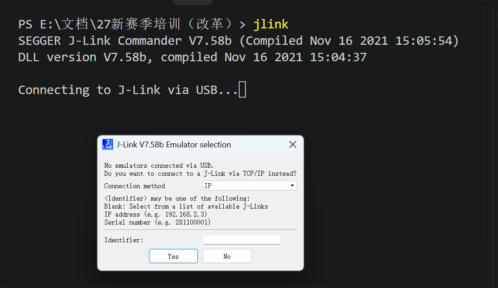

# cubmax 快速配置硬件
https://www.st.com.cn/zh/development-tools/stm32cubemx.html#section-get-software-table
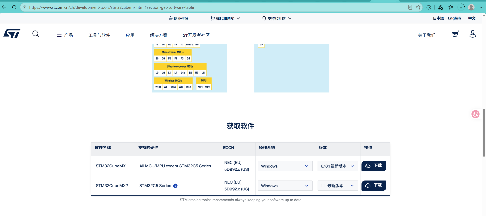
任意填写即可，QQ邮箱是自己真实的即可


## 电脑浏览器搜索QQ邮箱 登陆邮件下载 

## 文件夹位置要求和之前一样，后续不再提示
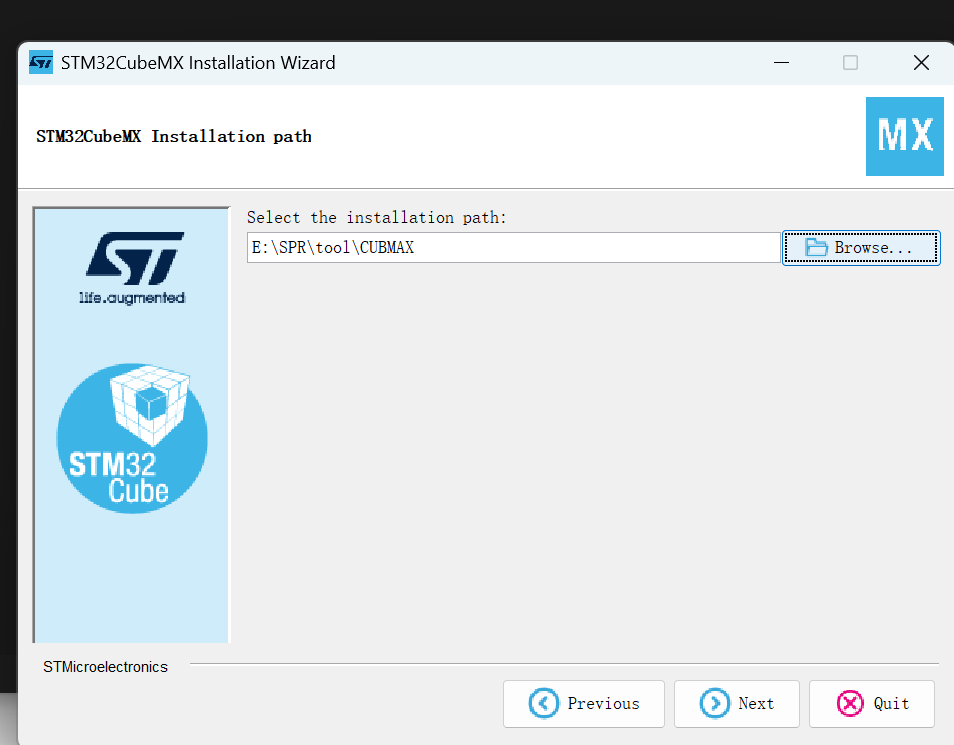
## 安装完成如下 点击done 装完了
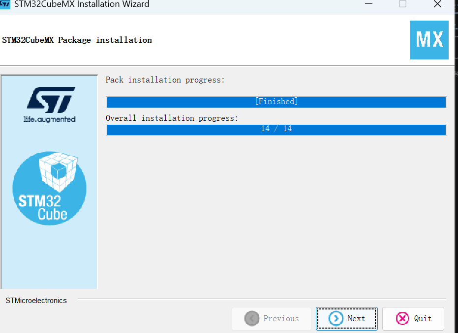
## 到对应文件夹 打开如图 有效
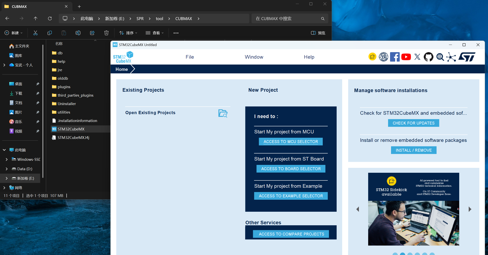
# ozone 波形
## 点击链接 https://www.segger.com/products/development-tools/ozone-j-link-debugger/  跳转，点击dowonload
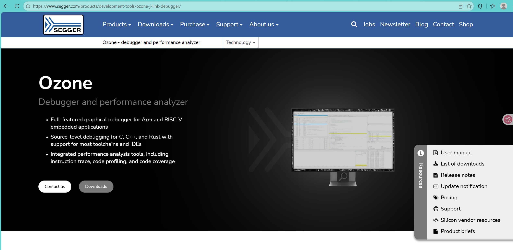
## 下滑找到中间的Ozone - The J-Link Debugger 选择 V3.20d版本 点击64bit下载
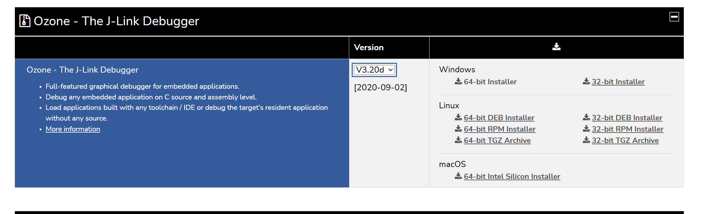
## 剪切该文件置于  点击 BROSWER 选择对应文件路径下
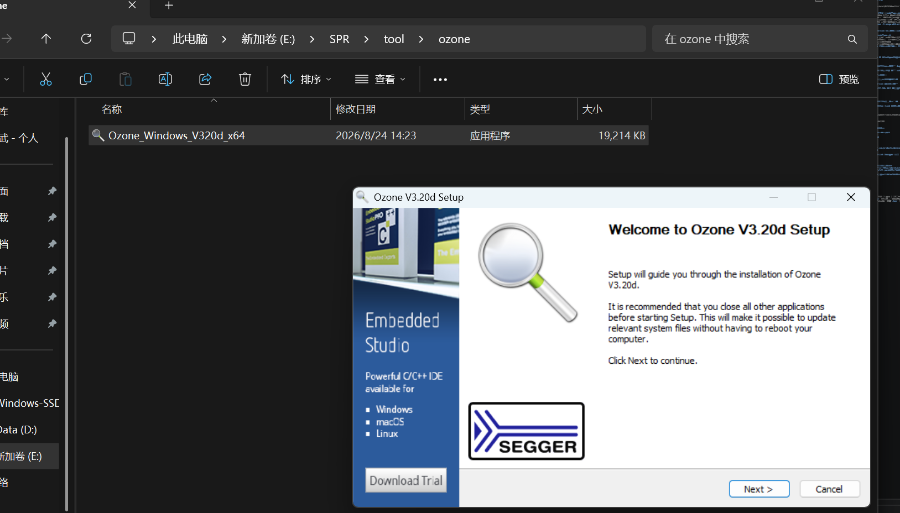
## 最终效果如图，有效
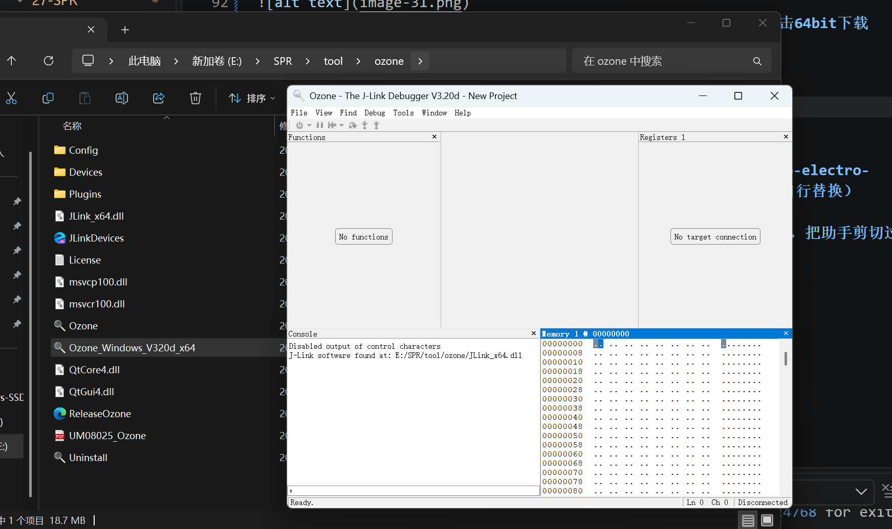
# 串口调试助手
## 到发到的软件驱动包里面完成串口驱动的下载
# 点击安装 E:\SPR\文档\中科大环境配置包\robo-electro-control\robo-electro-control\stm32 package series\refill pack（这是我电脑的路径，D盘自行替换）
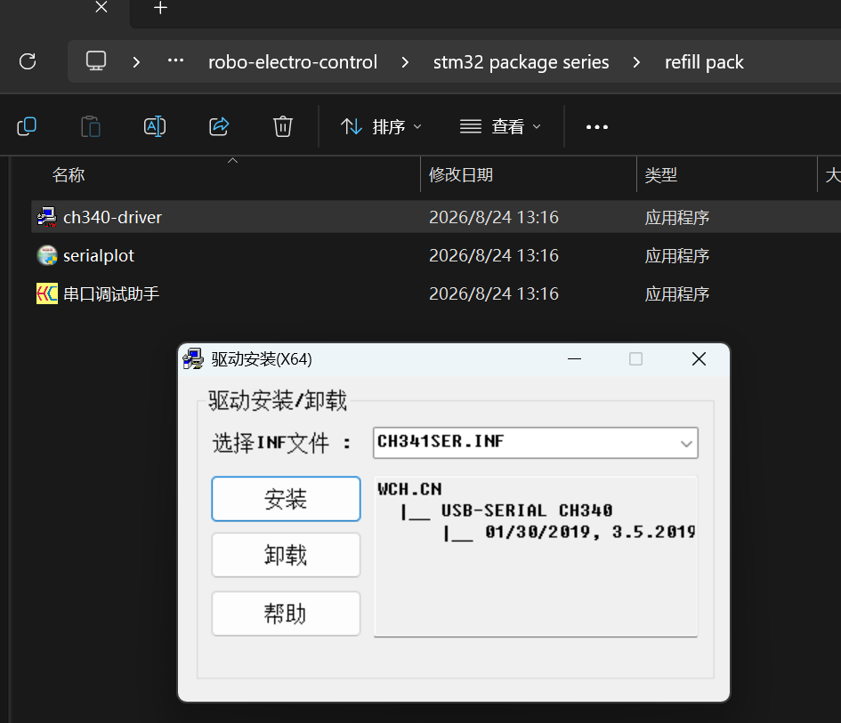
# 串口助手 即点即用 无需下载（在你自己的tool下面建usart-help文件夹，把助手剪切过去，方方便查找和日常使用）
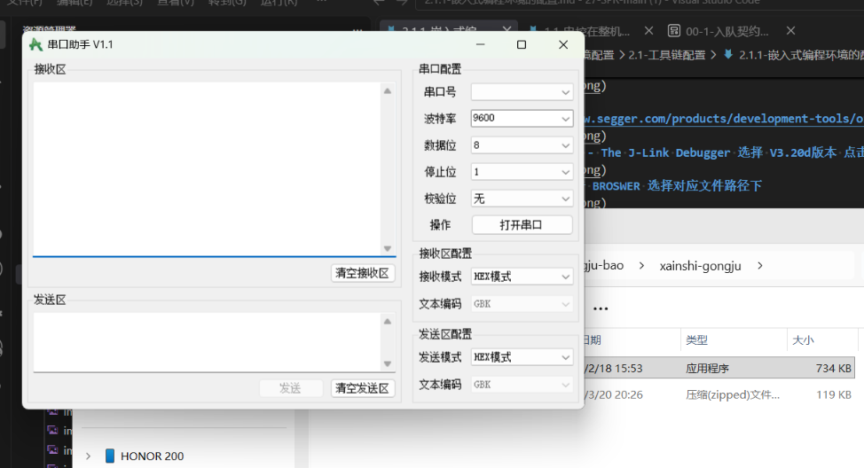

# 常见报错怎么办（先看这里）

> 下面这两条，新生第一周基本都会撞上一次。不是你的命令写错了，看完能省你半天。

## 报错一：git 连不上 GitHub

完整报错长这样：

```
fatal: unable to access 'https://github.com/darkcome6/27-SPR.git/':
Failed to connect to github.com port 443 after 21110 ms: Couldn't connect to server
```

意思是：**git 连不上 github.com，等了 21 秒放弃了**。跟你的命令、跟仓库都没关系。

### 先破除一个误解

**浏览器能打开 GitHub，不代表 git 能连上。**

浏览器会读 Windows 的「系统代理」设置；git **不读**——它默认自己直连。所以经常出现"网页刷得好好的，git 就是推不上去"。

### 判断技巧：看报错里的端口号

| 报错里的端口 | 意思 | 怎么办 |
|---|---|---|
| `github.com port 443` | 没走代理，或者代理节点不通 | 看下面「怎么修」 |
| `127.0.0.1 port 7890`（你自己代理软件的口） | git 配着代理，但**代理软件没开** | 把代理打开，或撤掉 git 的代理配置 |

### 怎么修

**第一步**：确认你的代理软件（Clash / 松果 / v2ray 等）正在运行，然后看它的**端口号**（一般在"设置"里，常见的是 7890 / 7892 / 10809）。

**第二步**：给 git 单独配上这个端口（下面的 7892 换成你自己的）：

```bash
git config --global http.proxy  http://127.0.0.1:7892
git config --global https.proxy http://127.0.0.1:7892
```

配完再 `git push` 试一次，一般就好了。

> **如果你根本没装代理软件**：那说明你的网络本身就上不了 GitHub，得先解决"能上外网"这件事——找学长要一个能用的工具。

### 反向坑（一定要记住）

配完代理以后，**代理软件一关，git 会换成报另一个错**：

```
Failed to connect to 127.0.0.1 port 7892: Connection refused
```

这时候要么把代理打开，要么把配置撤掉：

```bash
git config --global --unset http.proxy
git config --global --unset https.proxy
```

**一句话记住**：报错里是 `443` → 没走代理；是 `127.0.0.1` → 代理没开。

## 报错二：终端里的中文变成乱码

有两个表现，都是同一个原因。

**表现一：显示成乱码。** 比如分支名 `git-graph使用` 显示成 `git-graph浣跨敤`。

**表现二：中文当参数传给 git 会失败。**

```bash
git rev-list origin/main...origin/git-graph使用
fatal: ambiguous argument 'origin/main...origin/git-graph浣跨敤'
```

注意看报错里的名字：**它已经是乱码了**。说明中文在传进 git 之前就已经坏了。

**原因**：PowerShell 默认用 GBK 和外部程序交换文字，而 git 用的是 UTF-8。两边编码对不上。

### 怎么修

**临时（当前终端立刻生效）**：把这两行粘进去回车。

```powershell
[Console]::OutputEncoding = [System.Text.Encoding]::UTF8
$OutputEncoding = [System.Text.Encoding]::UTF8
```

**永久（每个新终端自动生效）**：写进 PowerShell 的配置文件。

```powershell
notepad $PROFILE
```

> 如果提示文件不存在，先执行这两行把目录和文件建出来，再打开：
>
> ```powershell
> New-Item -ItemType Directory -Force "$HOME\Documents\PowerShell" | Out-Null
> New-Item -ItemType File      -Force $PROFILE | Out-Null
> ```

把上面那两行粘进去、保存、重开终端，就永远生效了。

> **别用 `chcp 65001` 代替**：实测在某些终端里会让命令直接没有任何输出，反而更难排查。

**兜底**：VSCode 的图形界面（左边源码管理、点分支名切换）**不受这个编码问题影响**。终端里搞不定就直接用界面。

## 报错三：调试时说“文件不存在”

按 `F5` 启动调试时弹出：

```
Unable to start debugging. Unexpected GDB output from command "-environment-cd E:\文档\...\code_c_study".
E:\文档\...\code_c_study: No such file or directory.
```

**路径明明存在**，gdb 却说“不存在”——因为 **gdb 理解不了中文路径**（原理见 `2.1.0` 的第 5 条铁律）。

**怎么修**：把要调试的 `.c` 文件**复制到纯英文路径**下（比如 `E:\SPR\c_study`），在那里打开 VSCode 再按 `F5`。

> 注意：**编译和直接运行不受影响**——`Ctrl+Shift+B` 编译、`Ctrl+F5` 运行，在中文路径下都是好的，**只有调试不行**。

## 验收（一次过）


# 完成本节应该明白一点 自己的电脑环境和自己的工作环境都应该保持干净整洁，井井有条，才是自己工作高效的前提
