# 2.1 · 工具链全家桶配置

> 目标：把你的电脑变成一台"嵌入式开发工作站"。
## 要装什么、为什么

| 课程 | 装什么 | 为什么 |
|---|---|---|
| 2.1.1 | Keil | 保底方案：旧代码 / 救急用，不是你的主力 |
| 2.1.2 | VSCode + EIDE 插件 + GCC-ARM | 主力：现代编辑器 + 开源工具链 |
| 2.1.3 | CMake | 理解"编译过程"（预处理→编译→汇编→链接），而不是点一下按钮 |
| 2.1.4 | ST-Link + OpenOCD | 命令行烧录、可自动化的调试 |
| 2.1.5 | 串口助手（MobaXterm / Putty） | 串口是嵌入式工程师的第二只眼睛 |

## 配置
# keil
自行了解
Keil 是“新手村武器”——上手快，但出了新手村就没用了。

# vscode  编程
VSCode + GCC + CMake 是“真正上战场用的武器”——大厂的嵌入式团队、开源社区、机器人公司都在用这套组合
1. 下载 https://code.visualstudio.com/
2. 下载插件（左侧俄罗斯方块按钮） 
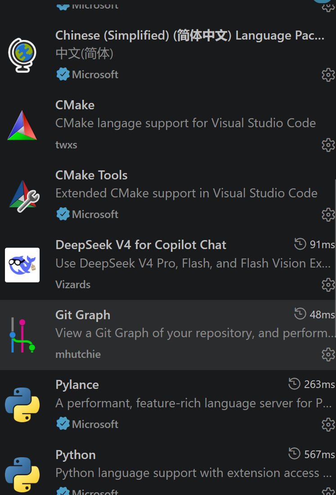
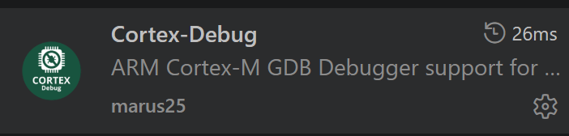
# 3. 工具链  MSYS2 MinGW64
MSYS2 + MinGW64 是这套方案的核心。简单来说，MSYS2 是包管理工具，MinGW64 是它里面的一个工具包。
我们要用它们来安装 arm-none-eabi- 系列工具链（用来编译 ARM 芯片代码）和 make、cmake 等构建工具
## (1) MSYS2（车间 + 仓库管理员）
它是什么：一个在 Windows 上运行的“类 Linux 环境”（提供 Bash 终端），外加一个包管理器（pacman）——类似手机上的应用商店。它干了什么：它帮你把 Windows 电脑“模拟”出一个可以敲 Linux 命令（如 make、ls、cd）的终端，并且负责从网上下载、安装、更新你需要的所有开发工具（GCC、CMake、Git 等）。
一句话总结：它是你所有开发工具的“底座”和“快递员”。
### 下载地址 https://www.msys2.org/
 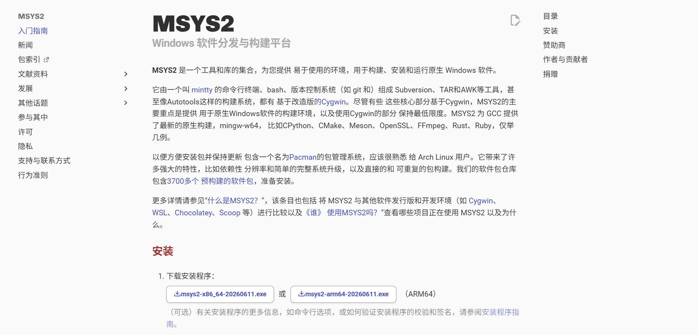
 点击下载的.exe文件
 选择文件路径E:\SPR\tool\tool-chain\MSYS2（自己按照上一章的要求进行创建文件夹）
 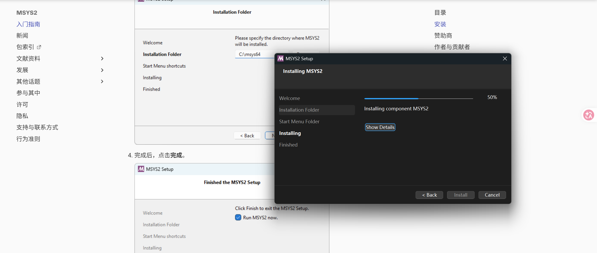
 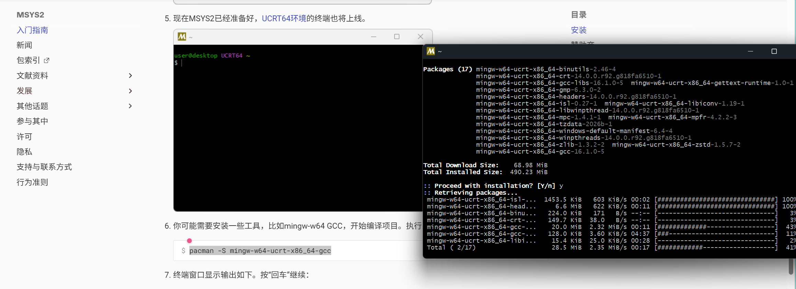
## （2）arm-none-eabi-gcc（造 STM32 程序的工具链）
它是什么：交叉编译器。它能把同样的 C/C++ 代码，编译成能在 STM32 芯片（ARM 架构）上运行的机器码（.bin 或 .hex 文件）。为什么叫“交叉”：因为你的电脑是 x86 架构，而 STM32 是 ARM 架构。“交叉”就是“在一台机器上编译出在另一台完全不同架构的机器上运行的程序”。一句话总结：这个工具造的东西，是给 STM32 芯片看的（跑在嵌入式板子上）。
### 安装 刚刚的终端中 输入 pacman -S mingw-w64-ucrt-x86_64-arm-none-eabi-toolchain 如图
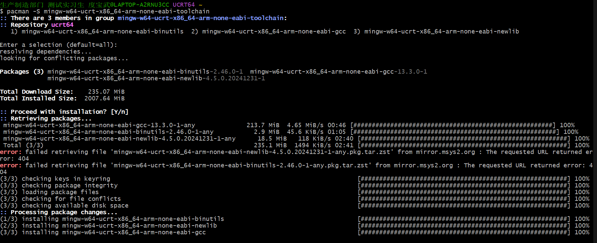
### 验证 arm-none-eabi-gcc --version 效果如下为有效
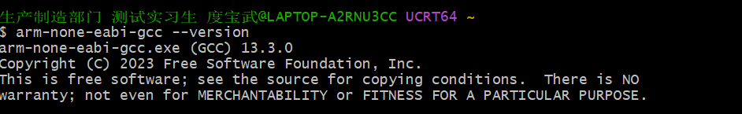
## 2. MinGW-w64（造 Windows 程序的工具链）
它是什么：GCC 编译器在 Windows 上的一个版本。它能把你写的 C/C++ 代码，编译成能在你电脑（x86架构）上直接运行的 .exe 程序。在开发中的作用：当你在电脑上写模拟程序、上位机测试工具，或者跑一些本地调试脚本时，用它来编译。
一句话总结：这个工具造的东西，是给你电脑自己看的（跑在 Windows 上）。
## MSYS2安装的时候已经安装过了 验证显示版本号为 有效

## 最终环节环境变量
### 1.电脑键盘左下角的方块 win 键 或者电脑屏幕最下面的蓝方块，搜索栏目搜索环境变量打开
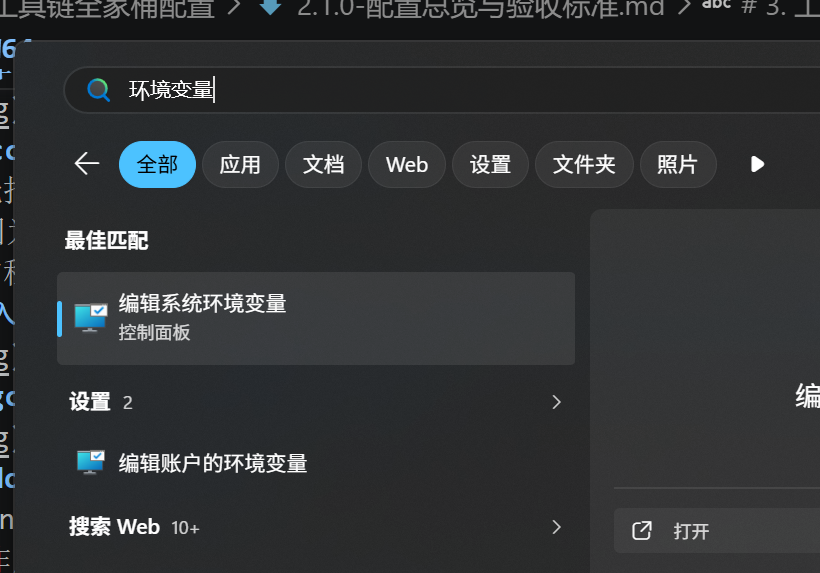
### 2. 点击环境变量

### 3.1 文件资源管理器（电脑文件夹应该都知道吧 dog） 找到这个目录，在上方复制路径

### 3.2 回到步骤二 点击环境变量，点击编辑 如图 粘贴刚刚复制的环境变量
 
### 4.添加该路径置电脑的系统环境变量中
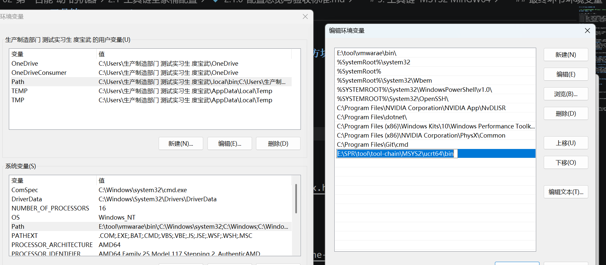
# 4. jlink 烧录工具的驱动
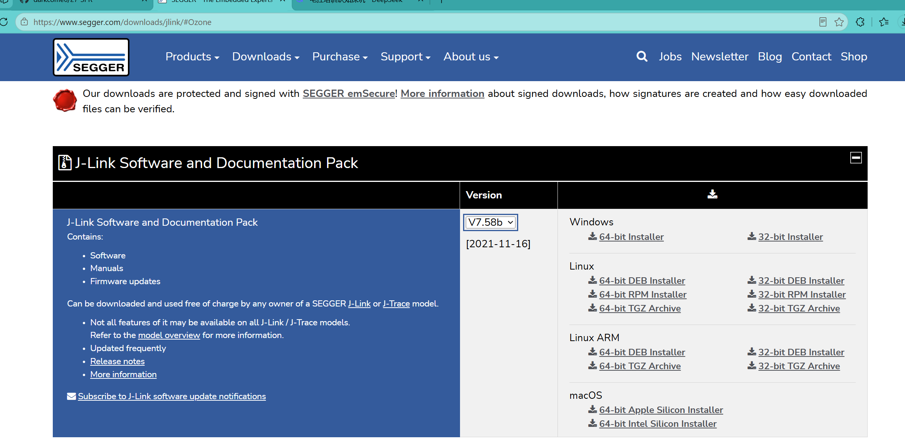
# cubmax 快速配置硬件
https://www.st.com.cn/zh/development-tools/stm32cubemx.html#section-get-software-table

# ozone 波形
https://www.segger.com/products/development-tools/ozone-j-link-debugger/
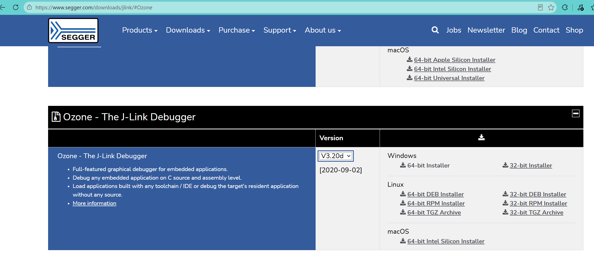

## 验收（一次过）

1. 能用**命令行**完成：编辑 → 编译 → 烧录 → 串口看到输出的完整闭环。
2. 第一份可运行工程已 `git init` 并完成第一次规范提交。
3. 能回答：`cmake` / `make` 分别做了什么？`.hex` / `.bin` / `.elf` 有什么区别？
