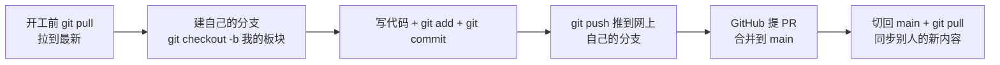

# 2.1.2 Git Graph + GitHub：让团队协作"看得见"

> 一句话：这一课让你的 git 从"黑乎乎的命令"变成"一张看得懂的图"，再配合 GitHub，让五个人一起写代码也不乱。
> 上节课你装好了 git 和 GitHub 仓库，这节课教你**真正用它协作**。

---

## 先抛问题：人多了一定会乱吗？

一个人写代码，代码在你脑子里，怎么改都行。两个人的时候呢？五个人，每个人各写一块，还要拼起来——

- 你改了 A，他也改了 A，**谁覆盖谁**？
- 你想看看"上一版长什么样"，**还找得回来吗**？
- 大家都在往同一个文件夹塞东西，**最后还分得清哪些是你的**吗？

**乱，是因为"看不见"。** 这一课就是给你一副"眼镜"，让这些看不见的东西，全部变成图。

---

## 第一部分：先搞懂 git 到底在干嘛（机制）

上节课你可能只是"照着敲命令"。这里讲透三个核心概念——因为后面所有操作，都是这三件事的排列组合：

| 概念 | 是什么（人话） | 打个比方 |
|---|---|---|
| **提交（commit）** | 给当前所有代码拍一张"快照"，存起来，带一句说明 | 游戏存档 |
| **分支（branch）** | 从某次提交"叉"出去的一条工作线 | 树枝 |
| **主干（main）** | 大家公认的正式版那条线 | 出版社已出版的书 |

> **关键机制：分支不是复制一份代码，它只是一个"指向某次提交的标签"**——所以建分支几乎不占空间，随便建、随便删。
> 你在自己分支上随便改，**不影响主干、不影响别人**。改好了再"接回去"（合并）。

一张图看懂"分支 + 合并"长什么样（这个图你等一下会亲眼在 Git Graph 里看到）：

> 注意看最后：两条线汇成一条——这就是**合并**。你的内容和别人的内容，在同一个点汇合，谁都不丢。

---

## 第二部分：Git Graph 是什么

**Git Graph 是 VS Code 的一个免费插件**，作用一句话：把你仓库的提交历史、分支、合并，画成一张**实时更新的图**。

它解决新手最大的痛苦——**"看不见我在哪"**。命令行的 `git log` 是一堆字，Git Graph 是一张图，你一眼就知道：我在哪条线上、队友推了什么、我落后没有。

它能干的事很多，这一课只教**最常用的 6 个**，够你用到毕业：

| 操作 | 干什么（人话） | 什么时候用 |
|---|---|---|
| **看图** | 点任意一个圆点 → 右边直接看这次提交改了哪些文件 | 想知道"之前改过啥" |
| **Fetch** | 去远程"打听"有没有新东西，只更新图形、不合并 | 每天开工第一件事（安全，随便点） |
| **Pull** | 把远程最新拉下来并合并 | 队友推了新东西，你要跟上 |
| **Push** | 把你本地的提交发到网上 | 写完一块，给全队看 |
| **Checkout** | 切换到某条分支/某个提交 | 从 main 切到自己的板块干活 |
| **Merge** | 把一条线并进你当前的线 | 把你的板块合并进 main |

---

## 第三部分：安装 + 打开（30 秒）

1. 左侧扩展商店搜索 **Git Graph**（作者 `mhutchie`）→ 安装
2. 打开：`Ctrl+Shift+P` → 输入 `Git Graph: View Git Graph` → 回车
3. 之后点**源代码管理面板**顶部的图标也能打开

---

## 第四部分：看懂这张图（认路）

打开你的 27-SPR 仓库，你会看到类似这样的东西，逐项认：

| 图里看到的 | 什么意思 |
|---|---|
| 一个**圆点** | 一次提交（存档点），鼠标放上去能看提交说明 |
| 一条**竖线（颜色线）** | 一条分支的"时间线" |
| **分支名标签**（main、02-toolchain…） | 这条线的名字，标在线的末端 |
| 一个**空心/实心的圆点标记** | 你**当前所在的位置**（HEAD） |
| 两个圆点之间有**分叉** | 有人从这儿开了新分支 |
| 两条线**汇合** | 这里发生过一次"合并" |

> 认识这张图，你就永远不会"迷路"：**你永远能指出来——我在哪、别人在哪、谁还没合进来。**

---

## 第五部分：配合 GitHub，五个人一起写（核心流程）

### GitHub 是什么

一个"**网上的公共仓库**"，你们所有人的代码在这里汇合。我们 27-SPR 的仓库：
`https://github.com/darkcome6/27-SPR`

### 团队协作标准流程（一人一条线，互不打架）

**为什么一人一条线？** 因为都直接在 main 上改，两个人同时改一个文件，后推的要么覆盖别人、要么报冲突，乱成一锅粥。一人一条线 = 每人一块独立"工作间"，写完统一验收合并。

### 多项目怎么管

- **每个项目一个仓库**（最清晰，项目之间互不干扰）
- 或**一个大仓库 + 目录隔离**（我们教材就是这么干的：`00~10` 每个板块一个文件夹，各写各的目录，几乎不会撞车）

### 团队红线（踩了会被骂 dog）

1. **提交前先 `git pull`** —— 别在旧版上改
2. **commit 说明写清楚** —— 用 `docs(02): 我干了啥` 的格式，别写 `update`、`111`
3. **别把大文件/安装包推上去** —— 用 `.gitignore` 提前挡（我们 1.9GB 的配置包就是这么被挡住的）
4. **别 force push** —— 会覆盖队友的提交，等于删别人的东西
5. **提交前 `git status` 看一眼** —— 只提交该提交的（还记得暂存区会"跟着分支走"的坑吗？）

---

## 验收（一次过）

- [ ] 你能在 GiGraph 里打开 27-SPR，**指出 main 在哪、你当前在哪**
- [ ] 你独立完成一轮完整流程：开自己的分支 → 提交一次改动 → 合并回 main → 推送 → 让队友能 pull 到
- [ ] 能回答：**分支为什么几乎不占空间？为什么团队要一人一条分支？**
- [ ] 能解释：那张图里"分叉"和"汇合"分别代表发生了什么

> 记住：**工具不是目的。目的是让五个人像一个人一样干活，而且谁都丢不了。**
> 你以后写的每一行代码，队友都能顺着这张图找到它——这就是版本管理的意义。
