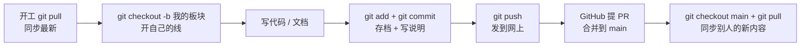

# 2.1.2 Git Graph + GitHub：团队协作实操

> 一句话：这一课把 git 里那些"名字"（配置、提交、分支、合并…）挨个讲清楚——它们**是什么意思**、**怎么操作**，最后配合 Git Graph 和 GitHub，让五个人一起写代码也不乱。

---

## 〇、先认识这些"名字"（速查表）

| 名字 | 一句话意思 | 类比 |
|---|---|---|
| 配置（config） | 告诉 git"你是谁"，提交时署名用 | 实名制 |
| 初始化（init / clone） | 把文件夹变成仓库 / 从网上下载仓库 | 开档案 / 领档案 |
| 提交（commit） | 把当前改动"存档"成一次快照，带一句说明 | 游戏存档 |
| 推送到 GitHub（push） | 把本地存档上传到网上公共仓库 | 发快递 |
| 同步（fetch / pull） | 把网上的最新改动拉下来 | 收快递 |
| 创建分支（branch） | 从当前位置叉出一条新工作线 | 长树枝 |
| 切换分支（checkout） | 跳到另一条工作线去干活 | 换工位 |
| 合并（merge） | 把一条工作线并进另一条 | 汇入主干道 |

下面挨个讲。每个都按"**什么意思 → 怎么操作 → 什么时候用**"来讲，命令行和 Git Graph 两种方式都给。

---

## 一、配置仓库（git config）——第一次用 git 必做

**什么意思**：让 git 知道你是谁。你每次提交（存档），会自动盖上你的名字和邮箱。不配置，git 会拒绝提交或乱署名。

**怎么操作**（终端，配一次永久有效，以后不用再配）：
```bash
git config --global user.name "你的名字"
git config --global user.email "你的邮箱"
```

**验证**：
```bash
git config --list   # 能看到你的名字和邮箱 = 配好了
```

> 注意：`--global` = 整台电脑生效。**分支怎么切、仓库怎么建，都不影响这个配置**——配一次，永久有效。

---

## 二、初始化 / 获取仓库（git init / git clone）

**什么意思**：
- **`git init`**：把一个普通文件夹"变成"一个 git 仓库（给文件夹装上版本管理）
- **`git clone`**：从 GitHub 把仓库**下载**到本地（拿到队友/自己的代码）

**怎么操作**：
```bash
# 从 GitHub 下载仓库到本地（团队场景 99% 用这个）
git clone https://github.com/darkcome6/27-SPR.git
```

**什么时候用**：换新电脑、新队友加入时，clone 一次即可。

> 机制补充：clone 完会自动配好"远程地址"（remote）——这就是后面 push / pull 发快递的"收货地址"。

---

## 三、提交 commit 信息（git add + git commit）

**什么意思**：把改动"存档"成一次版本记录。
- **`git status`**：先看看现在有哪些改动（体检）
- **`git add`**：把改动"装进购物车"（暂存区）——**只装你想提交的**
- **`git commit`**：把购物车里的东西"拍快照存档"，**必须写一句说明**（commit 信息）

**commit 信息怎么写（很重要）**：
```
docs(02): 完成工具链配置讲义
fix(08): 修正电机抖动排查逻辑
```
格式 = `类型(板块): 干了什么`。别写 `update`、`111`——你两个月后的自己会骂现在的你。

**怎么操作**：
```bash
git status                               # 1. 看看改了啥
```

```
git add .                                #全部改动加入暂存
git add 02-第一台能"动"的机器/            #把某个文件的改动加入暂存，add 后面是文件的路径 
```

```
git commit -m "docs(02): 完成配置讲义"     # 3. 存档 + 写说明
```
> VSCode 更简单：左侧「源代码管理」面板 → 输入说明 → 点"提交"按钮。

**在 Git Graph 里看**：提交成功后，图上会出现一个新的"圆点"。

---

## 四、提交到 GitHub（git push）

**什么意思**：把你本地的存档**上传到网上公共仓库**——队友才看得到。不 push，存档只在你电脑上。

**怎么操作**：
```bash
git push -u origin 我的分支名     # 第一次推这个分支用 -u（以后直接 git push）
```
**Git Graph**：点顶部工具栏的 **Push** 按钮（云朵上传图标）。

**什么时候用**：写完一块、想给全队看时。

---

## 五、同步修改（git fetch / git pull）

**什么意思**：把**网上最新**的改动拉回本地（队友可能已经推了东西）。
- **`fetch`**：只"打听"——把远程最新状态拉下来**更新图形**，但不合并你的代码
- **`pull`**：拉下来**并直接合并**到你当前分支

**怎么操作**：
```bash
git pull          # 拉最新并合并（日常最常用）
```
**Git Graph**：顶部有 Fetch / Pull 两个按钮。

**什么时候用**：**每天开工前、每次提交前**都 pull 一下——别在旧版上改。

---

## 六、创建分支（git branch）

**什么意思**：从当前位置"叉"出一条新的工作线。**关键机制：分支只是指向某次提交的标签，不是复制代码**——所以几乎不占空间，随便建、随便删。

**为什么团队要分支**：都直接改 main，两个人同时改一个文件就打架。一人一条分支 = 每人一块独立"工作间"。

**怎么操作**：
```bash
git branch 我的板块          # 创建分支（不切过去）
git checkout -b 我的板块     # 创建并立刻切换过去（最常用）
```
**Git Graph**：右键任意位置 → **Create Branch...** → 输入名字。

---

## 七、切换分支（git checkout / git switch）

**什么意思**：跳到另一条工作线去干活。切过去后，你看到的文件就是那条线上的版本。

**怎么操作**：
```bash
git checkout 我的板块    # 切到我的板块
git checkout main        # 切回主干
```
**Git Graph**：右键分支名 → **Checkout Branch...**。

> 小知识：未提交的改动会"跟着你走"（不归任何分支管）。所以切换前最好先提交，或记住"暂存区会跟着分支走"这个坑。

---

## 八、合并（git merge / PR）

**什么意思**：把一条工作线**并进**另一条。比如把你的板块分支并进 main。

**怎么操作**（先切到要"收"的那条线，再合并）：
```bash
git checkout main            # 1. 切到 main（接收合并的一方）
git merge 我的板块            # 2. 把板块分支并进来
git push                     # 3. 推送到网上
```
**Git Graph**：右键分支 → **Merge into current branch**。

**冲突是什么**：两个人改了同一处，git 不知道听谁的，就标出冲突（`<<<<<<< ======= >>>>>>>`）。处理 = 手动决定保留哪边，然后重新 add + commit。

**PR（Pull Request）**：在 GitHub 网页上"申请把分支合并进 main"，是团队看的**验收关口**——写完让负责人看一眼再进正式版。

---

## 九、完整流程串一遍（五个人协作的一天）



---

## 团队红线（踩了会被骂 dog）

1. **提交前先 `git pull`** —— 别在旧版上改
2. **commit 说明写清楚** —— 用 `docs(02): 我干了啥` 的格式，别写 `update`、`111`
3. **别推大文件 / 安装包** —— 用 `.gitignore` 提前挡（我们 1.9GB 的配置包就是这么被挡住的）
4. **别 force push** —— 等于删队友的东西
5. **提交前 `git status` 看一眼** —— 只提交该提交的

---

## 验收（一次过）

- [ ] 能说出：config / init / clone / add / commit / push / pull / branch / checkout / merge 各自**什么意思**
- [ ] 能独立走完一整轮：clone → 开分支 → 提交 → 推送 → 合并 → 同步
- [ ] 在 Git Graph 里：能指出 main 在哪、你当前在哪、谁还没合并
- [ ] 能写出一条规范的 commit 信息

> 记住：**工具不是目的。目的是让五个人像一个人一样干活，而且谁都丢不了。**
> 这些"名字"多操作几遍就熟了——**看图 + 上手，比背命令强一百倍。**
