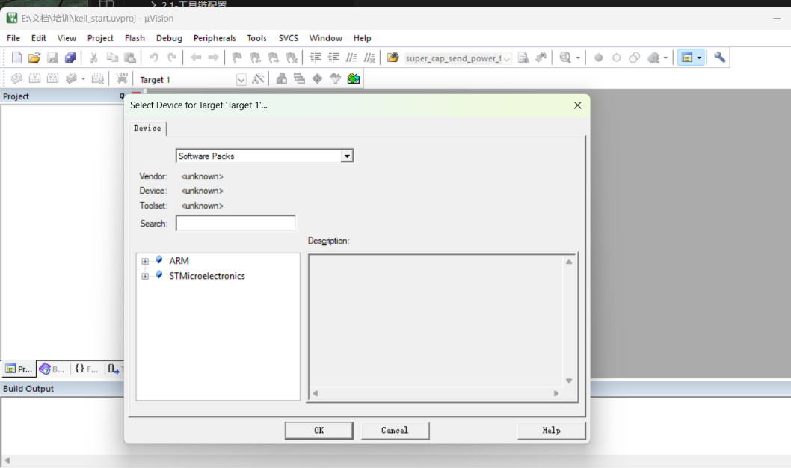
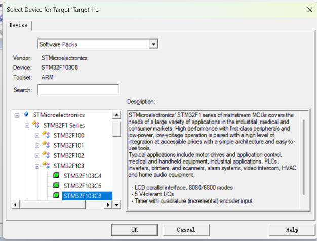
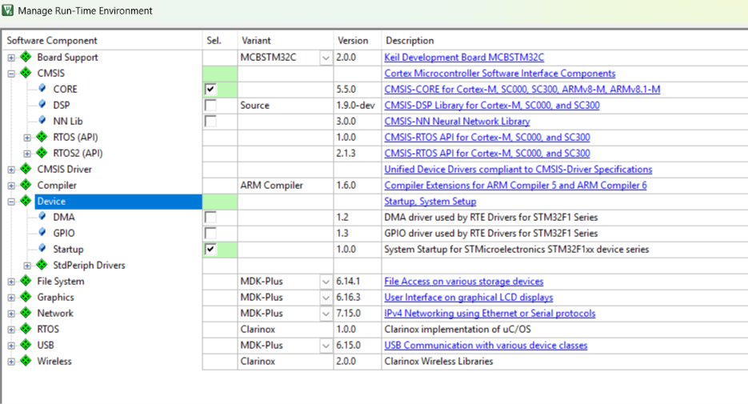

# 新建工程
# 为你的项目项目选择对应的芯片型号
|

选择可以看到对应的信息
厂商（Vendor），工具链(tool-set)，芯片描述(description)
# Manage Run‑Time Environment（RTE 运行时环境管理器

正常来说应该从这里添加内核文件，启动文件，选择对应的一些现成的库如DSP库（**CMSIS-DSP 是 ARM 官方写好、针对 STM32 内核高度优化的数学 / 信号处理函数库。**专门用来做大量复杂数学运算）但是对于新手这些太难了，直接叉掉，直接迁移现成的工程，后续能力强了或者有对应的需求再来这里进行添加
